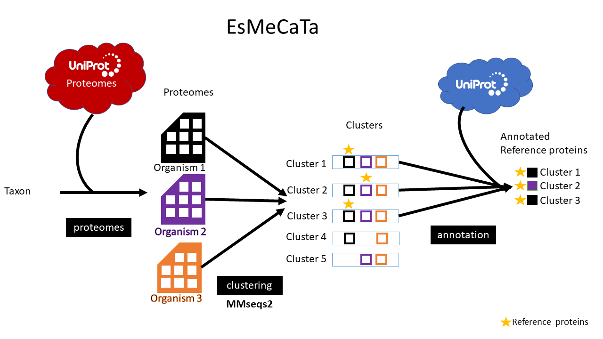

# EsMeCaTa: *Es*timating *Me*tabolic *Ca*pabilties from *Ta*xonomy

EsMeCaTa is a tool to estimate metabolic capabilities from a taxonomy (for example from 16S RNA sequencing). This is useful no sequenced genomes or proteomes are available.



## Requirements

EsMeCaTa needs the following python packages:
 
- [biopython](https://pypi.org/project/biopython/): To create fasta files.
- [pandas](https://pypi.org/project/pandas/): To read the input files.
- [requests](https://pypi.org/project/requests/): For the REST queries on Uniprot.
- [ete3](https://pypi.org/project/ete3/): To analyse the taxonomy and extract taxon_id, also used to deal with taxon associated with more than 100 proteomes.
- [SPARQLwrapper](https://pypi.org/project/SPARQLWrapper/): Optionnaly, you can use SPARQL queries instead of REST queries. This can be done either with the [Uniprot SPARQL Endpoint](https://sparql.uniprot.org/) (with the option `--sparql uniprot`) or with a Uniprot SPARQL Endpoint that you created locally (it is supposed to work but not tested, only SPARQL queries on the Uniprot SPARQL endpoint have been tested). **Warning**: using SPARQL queries will lead to minor differences in functional annotations and metabolic reactions due to how the results are retrived with REST query or SPARQL query.

Also esmecata requires mmseqs2 for protein clustering:

- [mmseqs2](https://github.com/soedinglab/MMseqs2): To cluster proteins.


## Input

EsMeCaTa takes as input a tabulated or an excel file with two columns one with the ID corresponding to the taxonomy (for example the OTU ID for 16S RNA sequencing) and a second column with taxonomy separated by ';'. In the following documentation, the first column (named `observation_name`) will be used to identify the label associated to each taxonomy.

For example:

| observation_name | taxonomy                                                                                                     |
|------------------|--------------------------------------------------------------------------------------------------------------|
| Cluster_1        | Bacteria;Spirochaetes;Spirochaetia;Spirochaetales;Spirochaetaceae;Sphaerochaeta;unknown species              |
| Cluster_2        | Bacteria;Chloroflexi;Anaerolineae;Anaerolineales;Anaerolineaceae;ADurb.Bin120;unknown species                |
| Cluster_3        | Bacteria;Cloacimonetes;Cloacimonadia;Cloacimonadales;Cloacimonadaceae;Candidatus Cloacimonas;unknown species |
| Cluster_4        | Bacteria;Bacteroidetes;Bacteroidia;Bacteroidales;Rikenellaceae;Rikenellaceae RC9 gut group;unknown species   |
| Cluster_5        | Bacteria;Cloacimonetes;Cloacimonadia;Cloacimonadales;Cloacimonadaceae;W5;unknown species                     |
| Cluster_6        | Bacteria;Bacteroidetes;Bacteroidia;Bacteroidales;Dysgonomonadaceae;unknown genus;unknown species             |
| Cluster_7        | Bacteria;Firmicutes;Clostridia;Clostridiales;Clostridiaceae;Clostridium;unknown species                      |

## EsMeCaTa functions

### Retrieve proteomes associated to taxonomy

For each taxon in each taxonomy EsMeCaTa will use ete3 to find the corresponding taxon ID. Then it will search for proteomes assocaited to these taxon ID in the Uniprot Proteomes database.

If there is only 1 proteomes, it will be put aside.

If there is more than 100 proteomes, esmecata will apply a specific method: (1) use the taxon ID associated to each proteomes to create a taxonomy tree with ete3, (2) from the root of the tree (the input taxon), esmecata will find the direct deescendant (sub-taxons), (3) then esmecata will compute the number of proteomes associated to each sub-taxon, (4) the corresponding proportions will be used to select randomly a number of proteomes corresponding to the propotion.
For example: for the taxon Clostridiales, 645 proteomes are found. Using the organism taxon ID associated to the 645 proteomes we found that there is 17 direct sub-taxons. Then for each sub-taxon we compute the percentage of proportion of proteomes given by the sub-taxon to the taxon Clostridiales.
There is 198 proteomes associated to the sub-taxon Clostridiaceae, the percentage will be computed as follow: 198 / 645 = 30% (if a percentage is superior to 1 it will be round down and if the percentage is lower than 1 it will be round up to keep all the low proportion sub-taxons). We will use this 30% to select randomly 30 proteomes amongst the 198 proteomes of Clostridiaceae. This is done for all the other sub-taxons, so we get a number of proteomes around 100 (here it will be 102). Due to the different rounds (up or down) the total number of proteomes will not be equal to exactly 100 but it will be around it.

Then the proteomes found will be downloaded.

### Proteins clustering

For each taxon (a row in the table) EsMeCaTa will use mmseqs2 to cluster the proteins. Then if a cluster contains at least one protein from each proteomes, it will be kept (this threshold can be change using the --threshold option). The representative proteins from the cluster will be used. A fasta file of all the representative proteins will be created for each taxon.

### Retrive proteins annotations

For each of the representative proteins conserved, esmecata will look for the annotation (GO terms, EC number, function, gene name, Interpro) in Uniprot. it will also look for the annotation of the protein of the same cluster than the representative one. And all the anntoations found for a cluster will be propagated to the representative proteins.

Then esmecata will create a tabulated file for each row of the input file and also a folde rcontaing PathoLogic file that can be used as input for Pathway Tools.

## EsMeCaTa commands

````
usage: esmecata [-h] [--version] {proteomes,clustering,annotation} ...

From taxonomy to metabolism using Uniprot. For specific help on each subcommand use: esmecata {cmd} --help

optional arguments:
  -h, --help            show this help message and exit
  --version             show program's version number and exit

subcommands:
  valid subcommands:

  {proteomes,clustering,annotation}
    proteomes           Download proteomes associated to taxon from Uniprot Proteomes.
    clustering          Cluster the proteins of the different proteomes of a taxon into a single set of representative
                        shared proteins.
    annotation          Retrieve protein annotations from Uniprot.

Requires: mmseqs2 and an internet connection (for REST and SPARQL queries, except if you have a local Uniprot SPARQL endpoint).
````

## EsMeCaTa outputs

### EsMecaTa proteomes

````
output_folder
├── result
│   └── Cluster_1
│       └── Proteome_1.faa
│       └── Proteome_2.faa
│   └── ...
├── result_single_proteome
│   └── Cluster_2
│       └── Proteome_3.faa
│   └── ...
├── tmp_proteome
│   └── Proteome_1.faa.gz
│   └── Proteome_2.faa.gz
│   └── Proteome_3.faa.gz
│   └── ...
├── log.json
├── proteome_cluster_tax_id.tsv
├── uniprot_release_metadata.json
````

The `result` folder contain one subfolder for each `observation_name` from the input file (except when only 1 proteome has been found then the results are stored in `result_single_proteome`). Each subfolder contains the proteome associated with the `observation_name`.

The `tmp_proteome` contains all the proteomes that have been found to be associated with one taxon.

`log.json` contains for each `observation_name` the name of the taxon and the corresponding taxon_id found with `ete3`.

`proteome_cluster_tax_id.tsv` contains the name, the taxon_id and the proteoems associated to each `observation_name`.

`uniprot_release_metadata.json` is a log about the Uniprot release used and how the queries ware made (REAST or SPARQL).

### EsMecaTa clustering

````
output_folder
├── mmseqs_tmp
│   └── Cluster_1
│       └── mmseqs intermediary files
│       └── ...
│   └── ...
├── reference_proteins
│   └── Cluster_1.tsv
│   └── ...
├── reference_proteins_fasta
│   └── Cluster_1.faa
│   └── ...
├── proteome_cluster_tax_id.tsv
````

The `mmseqs_tmp` folder contains the intermediary files of mmseqs2 for each `observation_name`.

The `reference_proteins` contains one tsv file per `observation_name` and this contains the clustered proteins. The column on the left contains the representative proteins of a cluster and the column of the right corresponds to the other proteins of the same cluster. There is two proteins per row so the same representative protein can be found multiple times.

The `reference_proteins_fasta` contains all the representative proteins associated to an `observation_name`.

The `proteome_cluster_tax_id.tsv` file is the same thant he one created in `esmecata proteomes`.

### EsMecaTa annotation

````
output_folder
├── annotation
│   └── Cluster_1.tsv
│   └── ...
├── annotation_reference
│   └── Cluster_1.tsv
│   └── ...
├── pathologic
│   └── Cluster_1
│       └── Cluster_1.pf
│   └── ...
│   └── taxon_id.tsv
├── uniprot_release_metadata.json
````

The `annotation` folder contains a tabulated file for each `observation_name`. It contains the annotation retrieved with Uniprot (protein_name, review, GO Terms, EC numbers, Interpros, Rhea IDs and gene name) associated to all the proteins in a proteome or associated to an `observation_name`.

The `annotation_reference` contains annotation only for the representative proteins, but the annotation of the other proteisn of the same cluster have been propagated to the representative protein.

The `pathologic` contains one sub-folder for each `observation_name` in which there is one PathoLogic file. There is also a `taxon_id.tsv` file which corresponds to a modified version of `proteome_cluster_tax_id.tsv` with only the `observation_name` and the `taxon_id`. This folder can be used as input to [mpwt](https://github.com/AuReMe/mpwt) to reconstruct metabolic networks using Pathway Tools PathoLogic.


The `uniprot_release_metadata.json` serves teh same purpose as the one used in `esmecata proteomes` to retrieve metadata about Uniprot release at the time of the query.
