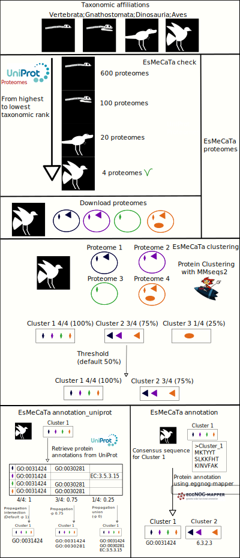

[](https://pypi.org/project/esmecata/) [](https://github.com/AuReMe/esmecata/blob/master/LICENSE) [](https://github.com/AuReMe/esmecata/actions) [](https://doi.org/10.1101/2022.03.16.484574)

# EsMeCaTa: *Es*timating *Me*tabolic *Ca*pabilties from *Ta*xonomic affiliations

EsMeCaTa is a tool to estimate metabolic capabilities from a taxonomic affiliation (for example after analysis on 16S RNA sequencing). This is useful if no sequenced genomes or proteomes are available.

Warning:

**A new version of UniProt is in development (see [UniProt beta](https://beta.uniprot.org/)), a compatible version of EsMeCaTa is in development (with the `--beta` option) but it may also been unstable.**



## Table of contents
- [EsMeCaTa: *Es*timating *Me*tabolic *Ca*pabilties from *Ta*xonomic affiliations](#esmecata-estimating-metabolic-capabilties-from-taxonomic-affiliations)
  - [Table of contents](#table-of-contents)
  - [Requirements](#requirements)
  - [Installation](#installation)
    - [Conda and pip](#conda-and-pip)
    - [Singularity](#singularity)
  - [Input](#input)
  - [EsMeCaTa commands](#esmecata-commands)
  - [EsMeCaTa functions](#esmecata-functions)
    - [`esmecata proteomes`: Retrieve proteomes associated with taxonomic affiliation](#esmecata-proteomes-retrieve-proteomes-associated-with-taxonomic-affiliation)
    - [`esmecata clustering`: Proteins clustering](#esmecata-clustering-proteins-clustering)
    - [`esmecata annotation`: Retrieve protein annotations](#esmecata-annotation-retrieve-protein-annotations)
    - [`esmecata workflow`: Consecutive runs of the three steps](#esmecata-workflow-consecutive-runs-of-the-three-steps)
  - [EsMeCaTa outputs](#esmecata-outputs)
    - [EsMeCaTa proteomes](#esmecata-proteomes)
    - [EsMeCaTa clustering](#esmecata-clustering)
    - [EsMeCaTa annotation](#esmecata-annotation)
    - [EsMeCaTa workflow](#esmecata-workflow)

## Requirements

EsMeCaTa needs the following python packages:
 
- [biopython](https://pypi.org/project/biopython/): To create fasta files.
- [pandas](https://pypi.org/project/pandas/): To read the input files.
- [requests](https://pypi.org/project/requests/): For the REST queries on Uniprot.
- [ete3](https://pypi.org/project/ete3/): To analyse the taxonomic affiliation and extract taxon_id, also used to deal with taxon associated with more than 100 proteomes.
- [SPARQLwrapper](https://pypi.org/project/SPARQLWrapper/): Optionally, you can use SPARQL queries instead of REST queries. This can be done either with the [Uniprot SPARQL Endpoint](https://sparql.uniprot.org/) (with the option `--sparql uniprot`) or with a Uniprot SPARQL Endpoint that you created locally (it is supposed to work but not tested, only SPARQL queries on the Uniprot SPARQL endpoint have been tested). **Warning**: using SPARQL queries will lead to minor differences in functional annotations and metabolic reactions due to how the results are retrieved with REST query or SPARQL query.

Also esmecata requires mmseqs2 for protein clustering:

- [mmseqs2](https://github.com/soedinglab/MMseqs2): To cluster proteins.


## Installation

### Conda and pip

The easiest way to install the dependencies of EsMeCaTa is by using conda:

```conda install mmseqs2 pandas sparqlwrapper requests biopython ete3 -c conda-forge -c bioconda```

A conda package for esmecata will be created in the future.

EsMeCata can be installed with pip command:

```pip install esmecata ```

It can also be installed using esmecata github directory:

```git clone https://github.com/ArnaudBelcour/esmecata.git```

```cd esmecata```

```pip install -e . ```

### Singularity

A Singularity recipe for EsMeCaTa is available [here](https://github.com/AuReMe/esmecata/blob/master/recipes/Singularity).

The image can be created with the following command:

```sudo singularity build  esmecata.sif Singularity```

And EsMeCaTa can be used with:

```singularity exec esmecata.sif esmecata workflow -i buchnera_workflow.tsv -o output```

## Input

EsMeCaTa takes as input a tabulated or an excel file with two columns one with the ID corresponding to the taxonomic affiliation (for example the OTU ID for 16S RNA sequencing) and a second column with the taxonomic classification separated by ';'. In the following documentation, the first column (named `observation_name`) will be used to identify the label associated with each taxonomic affiliation. An example is located in the test folder ([Example.tsv](https://github.com/ArnaudBelcour/esmecata/blob/master/test/Example.tsv)).

For example:

| observation_name | taxonomic_affiliation                                                                                        |
|------------------|--------------------------------------------------------------------------------------------------------------|
| Cluster_1        | Bacteria;Spirochaetes;Spirochaetia;Spirochaetales;Spirochaetaceae;Sphaerochaeta;unknown species              |
| Cluster_2        | Bacteria;Chloroflexi;Anaerolineae;Anaerolineales;Anaerolineaceae;ADurb.Bin120;unknown species                |
| Cluster_3        | Bacteria;Cloacimonetes;Cloacimonadia;Cloacimonadales;Cloacimonadaceae;Candidatus Cloacimonas;unknown species |
| Cluster_4        | Bacteria;Bacteroidetes;Bacteroidia;Bacteroidales;Rikenellaceae;Rikenellaceae RC9 gut group;unknown species   |
| Cluster_5        | Bacteria;Cloacimonetes;Cloacimonadia;Cloacimonadales;Cloacimonadaceae;W5;unknown species                     |
| Cluster_6        | Bacteria;Bacteroidetes;Bacteroidia;Bacteroidales;Dysgonomonadaceae;unknown genus;unknown species             |
| Cluster_7        | Bacteria;Firmicutes;Clostridia;Clostridiales;Clostridiaceae;Clostridium;unknown species                      |

It is possible to use EsMeCaTa with a taxonomic affiliation containing only one taxon:

| observation_name |taxonomic_affiliation|
|------------------|---------------------|
| Cluster_1        | Sphaerochaeta       |
| Cluster_2        | Yersinia            |

But this can cause issue. For example, "Cluster_2" is associated with Yersinia but two genus are associated with this name (one mantid (taxId: 444888) and one bacteria (taxId: 629)). EsMeCaTa will not able to differentiate them. But if you give more informations by adding more taxons (for example: 'Bacteria;Gammaproteobacteria;Yersinia'), EsMeCaTa will compare all the taxons of the taxonomic affiliation (here: 2 (Bacteria) and 1236 (Gammaproteobacteria)) to the lineage associated with the two taxIDs (for bacteria Yersinia: [1, 131567, 2, 1224, 1236, 91347, 1903411, 629] and for the mantid one: [1, 131567, 2759, 33154, 33208, 6072, 33213, 33317, 1206794, 88770, 6656, 197563, 197562, 6960, 50557, 85512, 7496, 33340, 33341, 6970, 7504, 7505, 267071, 444888]). In this example, there is 2 matches for the bacteria one (2 and 1236) and 0 for the mantid one. So EsMeCaTa will select the taxId associated with the bacteria (629).

A [jupyter notebook](https://github.com/AuReMe/esmecata/blob/master/tutorials/esmecata_method.ipynb) explains how EsMeCata works.

## EsMeCaTa commands

````
usage: esmecata [-h] [--version] {proteomes,clustering,annotation,workflow} ...

From taxonomic affiliation to metabolism using Uniprot. For specific help on each subcommand use: esmecata {cmd} --help

optional arguments:
  -h, --help            show this help message and exit
  --version             show program's version number and exit

subcommands:
  valid subcommands:

  {proteomes,clustering,annotation,workflow}
    proteomes           Download proteomes associated with taxon from Uniprot Proteomes.
    clustering          Cluster the proteins of the different proteomes of a taxon into a single set of representative shared proteins.
    annotation          Retrieve protein annotations from Uniprot.
    workflow            Run all esmecata steps (proteomes, clustering and annotation).

Requires: mmseqs2 and an internet connection (for REST and SPARQL queries, except if you have a local Uniprot SPARQL endpoint).
````

## EsMeCaTa functions

### `esmecata proteomes`: Retrieve proteomes associated with taxonomic affiliation

````
usage: esmecata proteomes [-h] -i INPUT_FILE -o OUPUT_DIR [-b BUSCO] [--ignore-taxadb-update] [--all-proteomes] [-s SPARQL] [--remove-tmp] [-l LIMIT_MAXIMAL_NUMBER_PROTEOMES] [--beta] [-r RANK_LIMIT]
                          [--minimal-nb-proteomes MINIMAL_NUMBER_PROTEOMES]

optional arguments:
  -h, --help            show this help message and exit
  -i INPUT_FILE, --input INPUT_FILE
                        Input taxon file (excel, tsv or csv) containing a column associating ID to a taxonomic affiliation (separated by ;).
  -o OUPUT_DIR, --output OUPUT_DIR
                        Output directory path.
  -b BUSCO, --busco BUSCO
                        BUSCO percentage between 0 and 1. This will remove all the proteomes without BUSCO score and the score before the selected ratio of completion.
  --ignore-taxadb-update
                        If you have a not up-to-date version of the NCBI taxonomy database with ete3, use this option to bypass the warning message and use the old version.
  --all-proteomes       Download all proteomes associated with a taxon even if they are no reference proteomes.
  -s SPARQL, --sparql SPARQL
                        Use sparql endpoint instead of REST queries on Uniprot.
  --remove-tmp          Delete tmp files to limit the disk space used: files in tmp_proteome for esmecata proteomes and files created by mmseqs (in mmseqs_tmp).
  -l LIMIT_MAXIMAL_NUMBER_PROTEOMES, --limit-proteomes LIMIT_MAXIMAL_NUMBER_PROTEOMES
                        Choose the maximal number of proteomes after which the tool will select a subset of proteomes instead of using all the available proteomes (default is 99).
  --beta                Use uniprot beta REST query.
  -r RANK_LIMIT, --rank-limit RANK_LIMIT
                        This option limit the rank used by the tool for searching for proteomes. The given rank and all the superior ranks will be ignored. Look at the readme for more information (and a list of possible rank).
  --minimal-nb-proteomes MINIMAL_NUMBER_PROTEOMES
                        Choose the minimal number of proteomes to be selected by EsMeCaTa. If a taxon has less proteomes, it will be ignored and a higher taxonomic rank will be used. Default is 1.
````

For each taxon in each taxonomic affiliations EsMeCaTa will use ete3 to find the corresponding taxon ID. Then it will search for proteomes associated with these taxon ID in the Uniprot Proteomes database.

If there is more than 100 proteomes, esmecata will apply a specific method:

* (1) use the taxon ID associated with each proteomes to create a taxonomic tree with ete3.

* (2) from the root of the tree (the input taxon), esmecata will find the direct deescendant (sub-taxons).

* (3) then esmecata will compute the number of proteomes associated with each sub-taxon.

* (4) the corresponding proportions will be used to select randomly a number of proteomes corresponding to the proportion.

For example: for the taxon Clostridiales, 645 proteomes are found. Using the organism taxon ID associated with the 645 proteomes we found that there is 17 direct sub-taxons. Then for each sub-taxon we compute the percentage of proportion of proteomes given by the sub-taxon to the taxon Clostridiales.
There is 198 proteomes associated with the sub-taxon Clostridiaceae, the percentage will be computed as follow: 198 / 645 = 30% (if a percentage is superior to 1 it will be round down and if the percentage is lower than 1 it will be round up to keep all the low proportion sub-taxons). We will use this 30% to select randomly 30 proteomes amongst the 198 proteomes of Clostridiaceae. This is done for all the other sub-taxons, so we get a number of proteomes around 100 (here it will be 102). Due to the different rounds (up or down) the total number of proteomes will not be equal to exactly 100 but it will be around it. The number of proteomes leading to this behavior is set to 99 by default but the user can modify it with the `-l/--limit-proteomes` option.

Then the proteomes found will be downloaded. For protein with isoforms, the [canonical sequence](https://www.uniprot.org/help/canonical_and_isoforms) is retrieved except when the isoforms are separated in different Uniprot entries.

`esmecata proteomes` options:

* `-s/--sparql`: use SPARQL instead of REST requests

It is possible to avoid using REST queries for esmecata and instead use SPARQL queries. This option need a link to a sparql endpoint containing UniProt. If you want to use the [SPARQL endpoint of UniProt](https://sparql.uniprot.org/sparql), you can use the argument: `-s uniprot`.

* `-b/--busco`: filter proteomes using BUSCO score (default is 0.9)

It is possible to filter proteomes according to to their BUSCO score (from Uniprot documentation: `The Benchmarking Universal Single-Copy Ortholog (BUSCO) assessment tool is used, for eukaryotic and bacterial proteomes, to provide quantitative measures of UniProt proteome data completeness in terms of expected gene content.`). It is a percentage between 0 and 1 showing the quality of the proteomes that esmecata will download. By default esmecata uses a BUSCO score of 0.80, it will only download proteomes with a BUSCO score of at least 80%.

* `--ignore-taxadb-update`: ignore need to udpate ete3 taxaDB

If you have an old version of the ete3 NCBI taxonomy database, you can use this option to use esmecata with it.

* `--all-proteomes`: download all proteomes (reference and non-reference)

By default, esmecata will try to downlaod the reference proteomes associated with a taxon. But if you want to download all the proteomes associated with a taxon (either if they are non reference proteome) you can use this option. Without this option non-reference proteoems can also be used if no reference proteomes are found.

* `--remove-tmp`: remove proteomes stored in `tmp_proteomes` folder

* `-l/--limit-proteomes`: choose the number of proteomes that will lead to the used of the selection of a subset of proteomes

To avoid working on too many proteomes, esmecata works on subset of proteomes when there is too many proteomes (by default this limit is set on 99 proteomes). Using this option the user can modify the limit.

* `--minimal-nb-proteomes`: choose the minimal number of proteomes that taxon must have to be selected by esmecata (default 1).

To avoid working on too little proteomes, it is possible to give an int to this option.
With this int, esmecata will select only taxon associated to at least this number of proteomes.
For example if you use `--minimal-nb-proteomes 10`, and the lowest taxon in the taxonomic affiliation is associated with 3 proteomes, it will be ignored and a taxon with a higer taxonomic rank will be used.

* `-r/--rank-limit`: This option limit the rank used by the tool for searching for proteomes. The given rank and all the superior ranks will be ignored.

To avoid working on rank with too much proteomes (which can have an heavy impact on the number of proteomes downloaded and then on the clustering) it is possible to select a limit on the taxonomic rank used by the tool.

The selected rank will be used to find the ranks to keep. For example, if the rank 'phylum' is given, all the rank below (from subphylum to isolate) will be kept. And the ranks from phylum to superkingdom will be ignored when searching for proteomes.
The following ranks can be given to this option (from Supplementary Table S3 of [PMC7408187](https://www.ncbi.nlm.nih.gov/pmc/articles/PMC7408187/)):

|Level           |Rank            |
|----------------|----------------|
|1               |superkingdom    |
|2               |kingdom         |
|3               |subkingdom      |
|4               |superphylum     |
|5               |phylum          |
|6               |subphylum       |
|7               |infraphylum     |
|8               |superclass      |
|9               |class           |
|10              |subclass        |
|11              |infraclass      |
|12              |cohort          |
|13              |subcohort       |
|14              |superorder      |
|15              |order           |
|16              |suborder        |
|17              |infraorder      |
|18              |parvorder       |
|19              |superfamily     |
|20              |family          |
|21              |subfamily       |
|22              |tribe           |
|23              |subtribe        |
|24              |genus           |
|25              |subgenus        |
|26              |section         |
|27              |subsection      |
|28              |series          |
|29              |subseries       |
|30              |species group   |
|31              |species subgroup|
|32              |species         |
|33              |forma specialis |
|34              |subspecies      |
|35              |varietas        |
|36              |subvariety      |
|37              |forma           |
|38              |serogroup       |
|39              |serotype        |
|40              |strain          |
|41              |isolate         |

Some ranks (which are not non-hierarchical) are not used for the moment when using this method (so some taxons can be removed whereas they are below a kept rank):

|Level           |Rank                   |Note                                                                                              |
|----------------|-----------------------|--------------------------------------------------------------------------------------------------|
|                |clade                  |newly introduced, can appear anywhere in the lineage w/o breaking the order                       |
|                |environmental samples  |no order below this rank is required                                                              |
|                |incertae sedis         |can appear anywhere in the lineage w/o breaking the order, implies taxa with uncertain placements |
|                |unclassified <name>    |no order below this rank is required, includes undefined or unspecified names                     |
|                |no rank                |applied to nodes not categorized here yet, additional rank and groups names will be released      |


### `esmecata clustering`: Proteins clustering

````
usage: esmecata clustering [-h] -i INPUT_DIR -o OUPUT_DIR [-c CPU] [-t THRESHOLD_CLUSTERING] [-m MMSEQS_OPTIONS] [--linclust] [--remove-tmp]

optional arguments:
  -h, --help            show this help message and exit
  -i INPUT_DIR, --input INPUT_DIR
                        This input folder of clustering is the output folder of proteomes command.
  -o OUPUT_DIR, --output OUPUT_DIR
                        Output directory path.
  -c CPU, --cpu CPU     CPU number for multiprocessing.
  -t THRESHOLD_CLUSTERING, --threshold THRESHOLD_CLUSTERING
                        Proportion [0 to 1] of proteomes required to occur in a proteins cluster for that cluster to be kept in core proteome assembly.
  -m MMSEQS_OPTIONS, --mmseqs MMSEQS_OPTIONS
                        String containing mmseqs options for cluster command (except --threads which is already set by --cpu command and -v). If nothing is given, esmecata will used the option "--min-seq-id 0.3 -c 0.8"
  --linclust            Use mmseqs linclust (clustering in lienar time) to cluster proteins sequences. It is faster than mmseqs cluster (default behaviour) but less sensitive.
  --remove-tmp          Delete tmp files to limit the disk space used: files in tmp_proteome for esmecata proteomes and files created by mmseqs (in mmseqs_tmp).
````

For each taxon (a row in the table) EsMeCaTa will use mmseqs2 to cluster the proteins (using an identity of 30% and a coverage of 80%, these values can be changed with the `--mmseqs`option). Then if a cluster contains at least one protein from each proteomes, it will be kept (this threshold can be changed using the `--threshold option`). The representative proteins from the cluster will be used. A fasta file of all the representative proteins will be created for each taxon.

`esmecata clustering` options:

* `-t/--threshold`: threshold clustering

It is possible to modify the requirements of the presence of at least one protein from each proteomes in a cluster to keep it. Using the threshold option one can give a float between 0 and 1 to select the ratio of representation of proteomes in a cluster to keep.

For example a threshold of 0.8 means that all the cluster with at least 80% representations of proteomes will be kept (with a taxon, associated with 10 proteomes, it means that at least 8 proteomes must have a protein in the cluster so the cluster must be kept).

* `-c/--cpu`: number of CPU for mmseqs2

You can give a numbe of CPUs to parallelise mmseqs2.

* `-m/--mmseqs`: mmseqs option to be used for the clustering.

String containing mmseqs options for cluster command (except --threads which is already set by --cpu command and -v). If nothing is given, esmecata will used the option "--min-seq-id 0.3 -c 0.8". For example you can give `--mmseqs "--min-seq-id 0.8 --kmer-per-seq 80"` to ask for a minimal identity between sequence of 80% and having 80 kmers per sequence.

* `--linclust`: replace `mmseqs cluster` by `mmseqs linclust` (faster but less sensitive)

Use mmseqs linclust (clustering in linear time) to cluster proteins sequences. It is faster than mmseqs cluster (default behaviour) but less sensitive.

* `--remove-tmp`: remove mmseqs files stored in `mmseqs_tmp` folder

### `esmecata annotation`: Retrieve protein annotations

````
usage: esmecata annotation [-h] -i INPUT_DIR -o OUPUT_DIR [-s SPARQL] [-p PROPAGATE_ANNOTATION] [--uniref] [--expression] [--beta]

optional arguments:
  -h, --help            show this help message and exit
  -i INPUT_DIR, --input INPUT_DIR
                        This input folder of annotation is the output folder of clustering command.
  -o OUPUT_DIR, --output OUPUT_DIR
                        Output directory path.
  -s SPARQL, --sparql SPARQL
                        Use sparql endpoint instead of REST queries on Uniprot.
  -p PROPAGATE_ANNOTATION, --propagate PROPAGATE_ANNOTATION
                        Proportion [0 to 1] of the occurrence of an annotation to be propagated from the protein of a cluster to the reference protein of the cluster. 0 mean the annotations from all proteins are propagated to the
                        reference and 1 only the annotation occurring in all the proteins of the cluster (default).
  --uniref              Use uniref cluster to extract more annotations from the representative member of the cluster associated with the proteins. Needs the --sparql option.
  --expression          Extract expression information associated with the proteins. Needs the --sparql option.
  --beta                Use uniprot beta REST query.
````

For each of the protein clusters kept after the clustering, esmecata will look for the annotation (GO terms, EC number, function, gene name, Interpro) in Uniprot.
By default, esmecata will look at the annotations of each proteins from a cluster and keeps only annotation occurring in all the protein of a cluster (threshold 1 of option -p).
It is like selecting the intersection of the annotation of the cluster. This can be changed with the option `-p` and giving a float between 0 and 1.

Then esmecata will create a tabulated file for each row of the input file and also a folder containing PathoLogic file that can be used as input for Pathway Tools.

`esmecata annotation` options:

* `-s/--sparql`: use SPARQL instead of REST requests

It is possible to avoid using REST queries for esmecata and instead use SPARQL queries. This option need a link to a sparql endpoint containing UniProt. If you want to use the [SPARQL endpoint](https://sparql.uniprot.org/sparql), you can just use: `-s uniprot`.

* `-p/--propagate`: propagation of annotation

It is possible to modify how the annotations are retrieved. By default, esmecata will take the annotations occurring in at least all the proteins of the cluster (`-p 1`). But with the `-p` option it is possible to propagate annotation form the proteins of the cluster to the reference proteins.

This option takes a float as input between 0 and 1, that will be used to filter the annotations retrieved. This number is multiplied by the number of protein in the cluster to estimate a threshold. To keep an annotation the number of the protein having this annotation in the cluster must be higher than the threshold. For example with a threshold of 0.5, for a cluster of 10 proteins an annotation will be kept if 5 or more proteins of the cluster have this annotation.

If the option is set to 0, there will be no filter all the annotation of the proteins of the cluster will be propagated to the reference protein (it corresponds to the **union** of the cluster annotations). This parameter gives the higher number of annotation for proteins. If the option is set to 1, only annotations that are present in all the proteins of a cluster will be kept (it corresponds to the **intersection** of the cluster annotations). This parameter is the most stringent and will limit the number of annotations associated with a protein.

For example, for the same taxon the annotation with the parameter `-p 0` leads to the reconstruction of a metabolic networks of 1006 reactions whereas the parameter `-p 1` creates a metabolic network with 940 reactions (in this example with no use of the `-p` option, so without annotation propagation, there was also 940 reactions inferred).

* `--uniref`: use annotation from uniref

To add more annotations, esmecata can search the [UniRef](https://www.uniprot.org/help/uniref) cluster associated with the protein associated with a taxon. Then the representative protein of the cluster will be extracted and if its identity with the protein of interest is superior to 90% esmecata will find its annotation (GO Terms and EC numbers) and will propagate these annotations to the protein. At this moment, this option is only usable when using the `--sparql` option.

* `--expression`: extract expression information

With this option, esmecata will extract the [expression information](https://www.uniprot.org/help/expression_section) associated with a protein. This contains 3 elements: Induction, Tissue specificity and Disruption Phenotype. At this moment, this option is only usable when using the `--sparql` option.

### `esmecata workflow`: Consecutive runs of the three steps

````
usage: esmecata workflow [-h] -i INPUT_FILE -o OUPUT_DIR [-b BUSCO] [-c CPU] [--ignore-taxadb-update] [--all-proteomes] [-s SPARQL] [--remove-tmp] [-l LIMIT_MAXIMAL_NUMBER_PROTEOMES] [-t THRESHOLD_CLUSTERING] [-m MMSEQS_OPTIONS]
                         [--linclust] [-p PROPAGATE_ANNOTATION] [--uniref] [--expression] [--beta] [-r RANK_LIMIT] [--minimal-nb-proteomes MINIMAL_NUMBER_PROTEOMES]

optional arguments:
  -h, --help            show this help message and exit
  -i INPUT_FILE, --input INPUT_FILE
                        Input taxon file (excel, tsv or csv) containing a column associating ID to a taxonomic affiliation (separated by ;).
  -o OUPUT_DIR, --output OUPUT_DIR
                        Output directory path.
  -b BUSCO, --busco BUSCO
                        BUSCO percentage between 0 and 1. This will remove all the proteomes without BUSCO score and the score before the selected ratio of completion.
  -c CPU, --cpu CPU     CPU number for multiprocessing.
  --ignore-taxadb-update
                        If you have a not up-to-date version of the NCBI taxonomy database with ete3, use this option to bypass the warning message and use the old version.
  --all-proteomes       Download all proteomes associated with a taxon even if they are no reference proteomes.
  -s SPARQL, --sparql SPARQL
                        Use sparql endpoint instead of REST queries on Uniprot.
  --remove-tmp          Delete tmp files to limit the disk space used: files in tmp_proteome for esmecata proteomes and files created by mmseqs (in mmseqs_tmp).
  -l LIMIT_MAXIMAL_NUMBER_PROTEOMES, --limit-proteomes LIMIT_MAXIMAL_NUMBER_PROTEOMES
                        Choose the maximal number of proteomes after which the tool will select a subset of proteomes instead of using all the available proteomes (default is 99).
  -t THRESHOLD_CLUSTERING, --threshold THRESHOLD_CLUSTERING
                        Proportion [0 to 1] of proteomes required to occur in a proteins cluster for that cluster to be kept in core proteome assembly.
  -m MMSEQS_OPTIONS, --mmseqs MMSEQS_OPTIONS
                        String containing mmseqs options for cluster command (except --threads which is already set by --cpu command and -v). If nothing is given, esmecata will used the option "--min-seq-id 0.3 -c 0.8"
  --linclust            Use mmseqs linclust (clustering in lienar time) to cluster proteins sequences. It is faster than mmseqs cluster (default behaviour) but less sensitive.
  -p PROPAGATE_ANNOTATION, --propagate PROPAGATE_ANNOTATION
                        Proportion [0 to 1] of the occurrence of an annotation to be propagated from the protein of a cluster to the reference protein of the cluster. 0 mean the annotations from all proteins are propagated to the
                        reference and 1 only the annotation occurring in all the proteins of the cluster (default).
  --uniref              Use uniref cluster to extract more annotations from the representative member of the cluster associated with the proteins. Needs the --sparql option.
  --expression          Extract expression information associated with the proteins. Needs the --sparql option.
  --beta                Use uniprot beta REST query.
  -r RANK_LIMIT, --rank-limit RANK_LIMIT
                        This option limit the rank used by the tool for searching for proteomes. The given rank and all the superior ranks will be ignored. Look at the readme for more information (and a list of possible rank).
  --minimal-nb-proteomes MINIMAL_NUMBER_PROTEOMES
                        Choose the minimal number of proteomes to be selected by EsMeCaTa. If a taxon has less proteomes, it will be ignored and a higher taxonomic rank will be used. Default is 1.
````

EsMeCTa will perform the search for proteomes, the protein clustering and the annotation.

## EsMeCaTa outputs

### EsMeCaTa proteomes

````
output_folder
├── proteomes_description
│   └── Cluster_1.tsv
│   └── Cluster_1.tsv
├── result
│   └── Cluster_1
│       └── Proteome_1.faa.gz
│       └── Proteome_2.faa.gz
│   └── Cluster_2
│       └── Proteome_3.faa.gz
│   └── Cluster_3
│       └── ...
├── tmp_proteome (can be cleaned to spare disk space using --remove-tmp option)
│   └── Proteome_1.faa.gz
│   └── Proteome_2.faa.gz
│   └── Proteome_3.faa.gz
│   └── ...
├── association_taxon_taxID.json
├── proteome_tax_id.tsv
├── esmecata_proteomes.log
├── esmecata_metadata_proteomes.json
├── stat_number_proteome.tsv
````

The `proteomes_description` contains list of proteomes find by esmecata on Uniprot associated with the taxonomic affiliation.

The `result` folder contain one sub-folder for each `observation_name` from the input file. Each sub-folder contains the proteome associated with the `observation_name`.

The `tmp_proteome` contains all the proteomes that have been found to be associated with one taxon.

`association_taxon_taxID.json` contains for each `observation_name` the name of the taxon and the corresponding taxon_id found with `ete3`.

`proteome_tax_id.tsv` contains the name, the taxon_id and the proteomes associated with each `observation_name`.

The file `esmecata_proteomes.log` contains the log associated with the command.

`esmecata_metadata_proteomes.json` is a log about the Uniprot release used and how the queries ware made (REST or SPARQL). It also gets the metadata associated with the command used with esmecata and the dependencies.

`stat_number_proteome.tsv` is a tabulated file containing the number of proteomes found for each observation name.

### EsMeCaTa clustering

````
output_folder
├── cluster_founds
│   └── Cluster_1.tsv
│   └── ...
├── computed_threshold
│   └── Cluster_1.tsv
│   └── ...
├── fasta_consensus
│   └── Cluster_1.faa
│   └── ...
├── fasta_representative
│   └── Cluster_1.faa
│   └── ...
├── mmseqs_tmp (can be cleaned to spare disk space using --remove-tmp option)
│   └── Cluster_1
│       └── mmseqs intermediary files
│       └── ...
│   └── ...
├── reference_proteins
│   └── Cluster_1.tsv
│   └── ...
├── reference_proteins_consensus_fasta
│   └── Cluster_1.faa
│   └── ...
├── reference_proteins_representative_fasta
│   └── Cluster_1.faa
│   └── ...
├── proteome_tax_id.tsv
├── esmecata_clustering.log
├── esmecata_metadata_clustering.json
├── stat_number_clustering.tsv
````

The `cluster_founds` contains one tsv file per `observation_name` and these files contain the clustered proteins The first column contains the representative proteins of a cluster and the following columns correspond to the other proteins of the same cluster. The first protein occurs two time: one as the representative member of the cluster and a second time as a member of the cluster.

The `computed_threshold` folder contains the ratio of proteomes represented in a cluster compared to the total number of proteomes associated with a taxon. If the ratio is equal to 1, it means that all the proteomes are represented by a protein in the cluster, 0.5 means that half of the proteoems are represented in the cluster. This score is used when giving the `-t` argument.

The `fasta_consensus` contains all the consensus proteins associated with an `observation_name`.

The `fasta_representative` contains all the representative proteins associated with an `observation_name`.

The `mmseqs_tmp` folder contains the intermediary files of mmseqs2 for each `observation_name`.

The `reference_proteins` contains one tsv file per `observation_name` and these files contain the clustered proteins kept after clustering process. it is similar to `cluster_founds` but it contains only protein kept after clustering and threshold.

The `reference_proteins_consensus_fasta` contains the consensus proteins associated with an `observation_name` for the cluster kept after clustering process. So compared to the fasta of `fasta_consensus` it is a sublist with only cluster passing the threshold.

The `reference_proteins_representative_fasta` contains the consensus proteins associated with an `observation_name` for the cluster kept after clustering process. So compared to the fasta of `fasta_representative` it is a sublist with only cluster passing the threshold.

The `proteome_tax_id.tsv` file is the same than the one created in `esmecata proteomes`.

The file `esmecata_clustering.log` contains the log associated with the command.

`esmecata_metadata_clustering.json` is a log about the the metadata associated with the command used with esmecata and the dependencies.

`stat_number_clustering.tsv` is a tabulated file containing the number of shared proteins found for each observation name.

### EsMeCaTa annotation

````
output_folder
├── annotation
│   └── Cluster_1.tsv
│   └── ...
├── annotation_reference
│   └── Cluster_1.tsv
│   └── ...
├── expression_annotation (if --expression option)
│   └── Cluster_1.tsv
│   └── ...
├── pathologic
│   └── Cluster_1
│       └── Cluster_1.pf
│   └── ...
│   └── taxon_id.tsv
├── uniref_annotation (if --uniref option)
│   └── Cluster_1.tsv
│   └── ...
├── esmecata_annotation.log
├── esmecata_metadata_annotation.json
````

The `annotation` folder contains a tabulated file for each `observation_name`. It contains the annotation retrieved with Uniprot (protein_name, review, GO Terms, EC numbers, Interpros, Rhea IDs and gene name) associated with all the proteins in a proteome or associated with an `observation_name`.

The `annotation_reference` contains annotation only for the representative proteins, but the annotation of the other proteins of the same cluster can be propagated to the reference protein if the `-p` was used.

The `expression_annotation` contains expression annotation for the proteins of a taxon (if the `--expression` option was used).

The `pathologic` contains one sub-folder for each `observation_name` in which there is one PathoLogic file. There is also a `taxon_id.tsv` file which corresponds to a modified version of `proteome_tax_id.tsv` with only the `observation_name` and the `taxon_id`. This folder can be used as input to [mpwt](https://github.com/AuReMe/mpwt) to reconstruct draft metabolic networks using Pathway Tools PathoLogic.

The file `esmecata_annotation.log` contains the log associated with the command.

The `esmecata_metadata_annotation.json` serves the same purpose as the one used in `esmecata proteomes` to retrieve metadata about Uniprot release at the time of the query. It also gets the metadata associated with the command used with esmecata and the dependencies.

The `uniref_annotation` contains the annotation from the representative protein of the UniRef cluster associated with the proteins of a taxon (if the `--uniref` option was used).

`stat_number_clustering.tsv` is a tabulated file containing the number of GO Terms and EC numbers found for each observation name.

### EsMeCaTa workflow

````
output_folder
├── 0_proteomes
  ├── proteomes_description
  │   └── Cluster_1.tsv
  │   └── Cluster_1.tsv
  ├── result
  │   └── Cluster_1
  │       └── Proteome_1.faa.gz
  │       └── Proteome_2.faa.gz
  │   └── Cluster_2
  │       └── Proteome_3.faa.gz
  │   └── Cluster_3
  │       └── ...
  ├── tmp_proteome (can be cleaned to spare disk space using --remove-tmp option)
  │   └── Proteome_1.faa.gz
  │   └── Proteome_2.faa.gz
  │   └── Proteome_3.faa.gz
  │   └── ...
  ├── association_taxon_taxID.json
  ├── proteome_tax_id.tsv
  ├── esmecata_metadata_proteomes.json
  ├── stat_number_proteome.tsv
├── 1_clustering
  ├── cluster_founds
  │   └── Cluster_1.tsv
  │   └── ...
  ├── computed_threshold
  │   └── Cluster_1.tsv
  │   └── ...
  ├── fasta_consensus
  │   └── Cluster_1.faa
  │   └── ...
  ├── fasta_representative
  │   └── Cluster_1.faa
  │   └── ...
  ├── mmseqs_tmp (can be cleaned to spare disk space using --remove-tmp option)
  │   └── Cluster_1
  │       └── mmseqs intermediary files
  │       └── ...
  │   └── ...
  ├── reference_proteins
  │   └── Cluster_1.tsv
  │   └── ...
  ├── reference_proteins_consensus_fasta
  │   └── Cluster_1.faa
  │   └── ...
  ├── reference_proteins_representative_fasta
  │   └── Cluster_1.faa
  │   └── ...
  ├── proteome_tax_id.tsv
  ├── esmecata_metadata_clustering.json
  ├── stat_number_clustering.tsv
├── 2_annotation
  ├── annotation
  │   └── Cluster_1.tsv
  │   └── ...
  ├── annotation_reference
  │   └── Cluster_1.tsv
  │   └── ...
  ├── expression_annotation (if --expression option)
  │   └── Cluster_1.tsv
  │   └── ...
  ├── pathologic
  │   └── Cluster_1
  │       └── Cluster_1.pf
  │   └── ...
  │   └── taxon_id.tsv
  ├── uniref_annotation (if --uniref option)
  │   └── Cluster_1.tsv
  │   └── ...
  ├── esmecata_metadata_annotation.json
  ├── stat_number_annotation.tsv
├── esmecata_workflow.log
├── esmecata_metadata_workflow.json
├── stat_number_workflow.tsv
````

The files in the folders `0_proteomes`, `1_clustering` and `2_annotation` are the same than the other presented in the previous steps.

The file `esmecata_workflow.log` contains the log associated with the command.

The `esmecata_metadata_workflow.json` retrieves metadata about Uniprot release at the time of the query, the command used and its duration.

`stat_number_workflow.tsv` is a tabulated file containing the number of proteomes, shared proteins, GO Terms and EC numbers found for each observation name.
